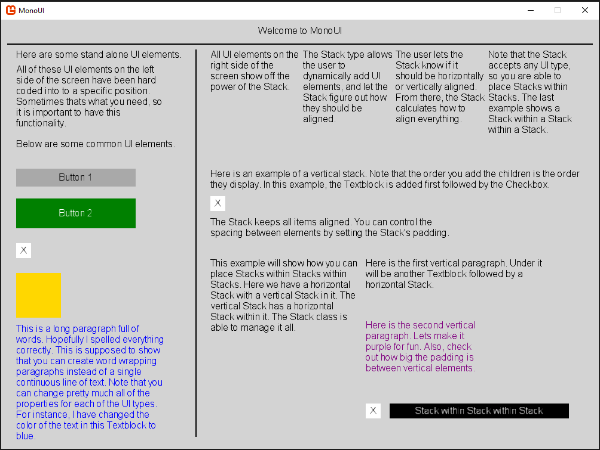

# MonoUI
## _Overview_

MonoUI is a basic UI library for the Monogame framework. Monogame is an open source, modern implementation of Microsoft's XNA framework. Since Monogame is just a framework, it does not come with any UI types or libraries. MonoUI aims to deliver a base UI foundation for Monogame.

Note: MonoUI is a constant work in progress. UI elements and functionality will be added as time goes on. If you dont find what you need, come back later!

### Features
- Box
  - The Box class draws a static box on the screen.
  - The user is able to determine the size of the box and its color.
- Button
  - The Button class draws a button to the screen.
  - The user is able to check the state of the Button during the Update loop (mouse left clicked, mouse left held, mouse right clicked, mouse right held, and mouse hovering).
  - The user can set the display text on the Button. The user can set the dimensions of the Button.
  - The user can set the colors of all Button attributes (text color, background color, clicked color, and hover color).
- Checkbox
  - The Checkbox class draws a checkbox to the screen.
  - The user can check the state of the Checkbox during the Update loop.
  - The user can set the state of the Checkbox at any time in code or by clicking the Checkbox.
- DividerLine
  - The DividerLine class draws a horizontal or vertical line to the screen.
  - The user can set the position, length, thickness, color, and orientation of the line.
- Textblock
  - The Textblock class allows the user to write static text onto the screen.
  - The user can set the position and color of the text.
  - The user can define if the text should word wrap, or draw in a continuous straight line.
    - When the Textblock is word wrapped, the user can set the width of the word wrapped paragraph.
- Stack
  - The Stack class allows the user to combine multiple UI types without having to hard code their spacing. In other words, the user sets the position of the Stack then adds UI elements to it. The Stack figures out how those child elements should be aligned.
  - The user can determine if the stack should be horizontally or vertically aligned. The spacing between elements can be changed by setting the padding.
  - Any UI type works. This means that the user can place stacks within stacks.

### Upcoming Features
- All positions operate with percentages (Ex: position(50%, 50%) meaning middle of screen).
- Word wrapping Textblocks have alignments (left align, center align, right align).
- Add a circle primitive. It will operate like the Box type, but draw a cicle instead.
- Add an image UI type. The image will have scaling and rotation.
- Add a Dropdown/Combobox type allowing users to select an item from a dropdown box.
- Add a Textbox type to allow users to enter text into a field.
- Add a Radio button feature to the Checkbox class grouping together multiple Checkboxes.
- Allow users to set fonts and font size of Textblock.

This `Upcoming Features` list will continually expand and grow. Items will be crossed out and added as time goes on. If there are any features you would like to see, ping me and I will add them to the list.

### Monogame Information
Monogame website: https://www.monogame.net/

Quick start and installation: https://docs.monogame.net/articles/getting_started/0_getting_started.html

Use the links above to learn more about the Monogame framework.

#### Development

This tool was written in C#/.NET and was creating using the Monogame framework. Free use for everyone. MIT License.
